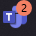
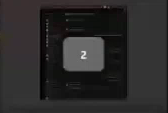

# MS Teams Notification badges - Chrome Extension

Don't miss a MS Team Notification with this extension.

It is useful to display notification badges on ms teams icons in the task bar when you are using a [web application version](https://support.microsoft.com/en-us/topic/install-manage-or-uninstall-apps-in-microsoft-edge-0c156575-a94a-45e4-a54f-3a84846f6113) of MS Teams. It shows the number of unread notifications in the badges which is refreshed in real time.

Unread badge notifications stay in the taskbar even if you close you browser.

## Table of contents

- [MS Teams Notification badges - Chrome Extension](#ms-teams-notification-badges---chrome-extension)
  - [Table of contents](#table-of-contents)
  - [Features](#features)
    - [Preview](#preview)
  - [Installation](#installation)
  - [Usage](#usage)
  - [Comptability](#comptability)
  - [Uninstall](#uninstall)
  - [Contribution](#contribution)
  - [License](#license)
  - [Feedback](#feedback)

## Features

- Add unread notifications count in overlay of the ms teams taskbar icons

### Preview

**Taskbar icon:**

**Window preview:** 

## Installation 

Follow the steps to install the **MS Teams Notification badges** extension:

1. Download the [latest release](https://github.com/devoldoak/msteams-notification-badges/archive/refs/tags/1.0.0.zip) of the extension
2. Unzip the download file.
3. Open the `edge://extensions` url in your edge browser.
4. Enable the **"Developer mode"** on the left pane.
5. Drag and drop the unzipped folder in the center of the page.
6. Disable the **"Developer mode"** on the left pane.

> NOTE: Your organization must allow the developer mode on your browser while this extension is not yet published.

## Usage

Once the extension is installed, only start your ms teams web applications as usual and wait for a new notification.

## Comptability

| API Used              | Edge Compatibility    |
|-----------------------|-----------------------|
| Badging API           | Edge 81+              |

## Uninstall

Here are the instructions to uninstall **MS Teams Notification badges** extension:

1. Go back to the `edge://extensions` url in your edge browser.
2. Click on **"Delete"** on the extension

## Contribution

Contributions to the MS Teams Notification badges Extension are welcome! If you have any ideas, bug fixes, or enhancements, please follow these steps:

1. Fork the repository and clone it to your local machine.
2. Make your desired changes and test them thoroughly.
3. Commit your changes and push them to your forked repository.
4. Submit a pull request, describing the changes you made and their purpose.

## License

This project is licensed under the [**MIT License**](./LICENSE).

## Feedback 

If you encounter any issues or have suggestions for improvements, please [open an issue](https://github.com/devoldoak/msteams-notification-badges/issues) on the GitHub repository page. We appreciate your feedback and will do our best to address any concerns.
